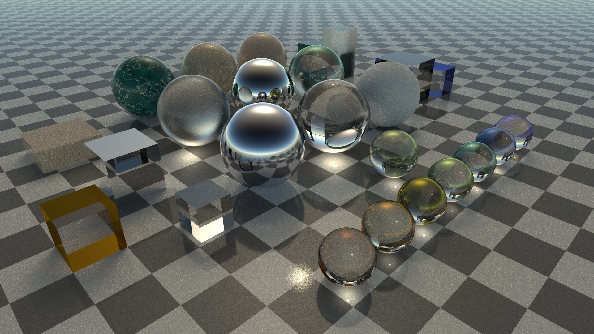

# Vulkan Path Tracer

A real-time path tracer using Vulkan compute shaders and Qt for the frontend.



## Features

- **Real-time path tracing** with progressive accumulation
- **Physically-based materials**:
  - Diffuse (Lambertian)
  - Metal with configurable roughness
  - Dielectric (glass) with refraction
  - Rough dielectric (frosted glass)
  - Emissive
  - Dichroic coated glass with tunable spectrum (thin-film interference)
  - Procedural textures: marble, wood, swirl, checker
- **Physically-based sky**:
  - Rayleigh scattering for blue sky and sunset colors
  - Mie scattering for sun glow
  - Day/night cycle with twilight transitions
  - Procedural stars at night
- **Geometry**: Spheres and axis-aligned boxes
- **Spotlights with gobo patterns**:
  - Configurable cone angles with smooth falloff
  - 6 gobo patterns: solid, stripes, grid, circles, dots, star
  - Pattern rotation and scale controls
- **Next Event Estimation (NEE)** for efficient direct lighting
- **Interactive camera**: Orbit, pan, zoom with mouse
- **Adaptive sampling**: Targets 60fps, scales sample count to use available GPU headroom
- **Auto-convergence**: Stops rendering after ~200 frames to let GPU rest

## Controls

- **Left mouse drag**: Orbit camera
- **Right mouse drag**: Pan camera
- **Scroll wheel**: Zoom
- **`[` / `]`**: Adjust sun azimuth
- **`{` / `}`**: Adjust sun elevation (full day/night cycle)
- **`,` / `.`**: Cycle spotlight gobo patterns (includes "off")
- **`S`**: Save screenshot

## Building

Requires:
- Vulkan SDK
- Qt 6
- CMake 3.20+
- glslc (for shader compilation)

```bash
mkdir build && cd build
cmake ..
cmake --build .
./raydemo
```

## Project Structure

```
src/
  core/                      # libraycore - shared rendering library
    types.h                  # Vec3 and math utilities
    camera.h                 # OrbitCamera with mouse controls
    materials.h              # Material types (diffuse, metal, glass, etc.)
    geometry.h               # Geometry primitives (Sphere, Box)
    lights.h                 # SpotLight with gobo patterns
    scene.h                  # Scene container with JSON serialization
    renderer.h/.cpp          # Vulkan renderer and window

  apps/
    raydemo/                 # Ray tracing demo
      main.cpp               # Application entry point
      test_scene.h/.cpp      # Scene factory function

shaders/
  raytrace.comp              # Main path tracing shader
  includes/
    noise.glsl               # Procedural noise (Perlin, FBM, Worley)
    random.glsl              # PCG random number generation
    geometry.glsl            # Ray intersection tests
    materials.glsl           # Material scattering functions
    lights.glsl              # Spotlight evaluation

docs/
  adr/                       # Architecture Decision Records
```

## Creating a New App

1. Create a new directory under `src/apps/`:
   ```
   src/apps/myapp/
     main.cpp
     my_scene.h
     my_scene.cpp
   ```

2. Create your scene factory:
   ```cpp
   // my_scene.h
   #pragma once
   #include "scene.h"
   Scene createMyScene();

   // my_scene.cpp
   #include "my_scene.h"
   Scene createMyScene() {
       Scene scene;
       // Add materials, geometry, lights...
       scene.addMaterial(MaterialType::Diffuse, {0.8f, 0.2f, 0.2f});
       scene.addSphere({0, 1, 0}, 1.0f, 0);
       return scene;
   }
   ```

3. Create main.cpp (copy from raydemo and change the include):
   ```cpp
   #include "renderer.h"
   #include "my_scene.h"
   // ... same as raydemo/main.cpp but with:
   window.setScene(createMyScene());
   ```

4. Add to CMakeLists.txt:
   ```cmake
   add_demo(myapp ${CMAKE_SOURCE_DIR}/src/apps/myapp
       src/apps/myapp/main.cpp
       src/apps/myapp/my_scene.cpp
   )
   ```

5. Build and run:
   ```bash
   cmake --build build
   ./build/myapp
   ```

## Technical Notes

- Compute shader based (no hardware RT required)
- 7-wavelength spectral sampling for dichroic materials
- Hybrid accumulation: temporal averaging when moving, proper accumulation when stationary
- Framerate-adaptive multi-sampling: more samples when GPU has headroom
- Precision-optimized ground plane intersection to avoid floating-point artifacts
- Auto-idle after convergence to reduce GPU power consumption
